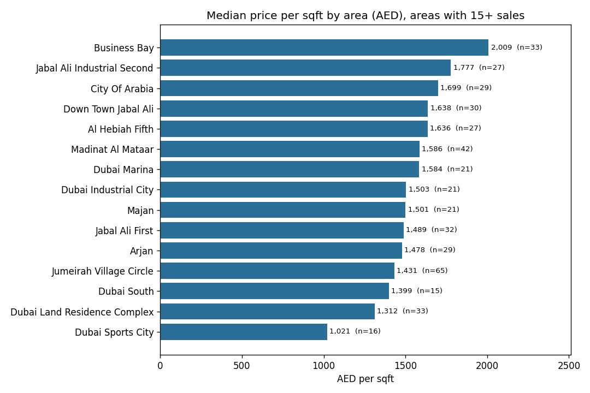
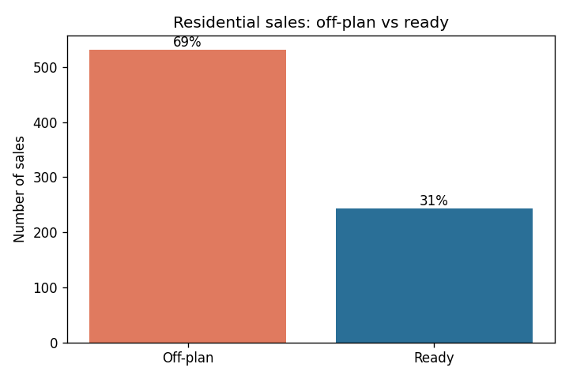
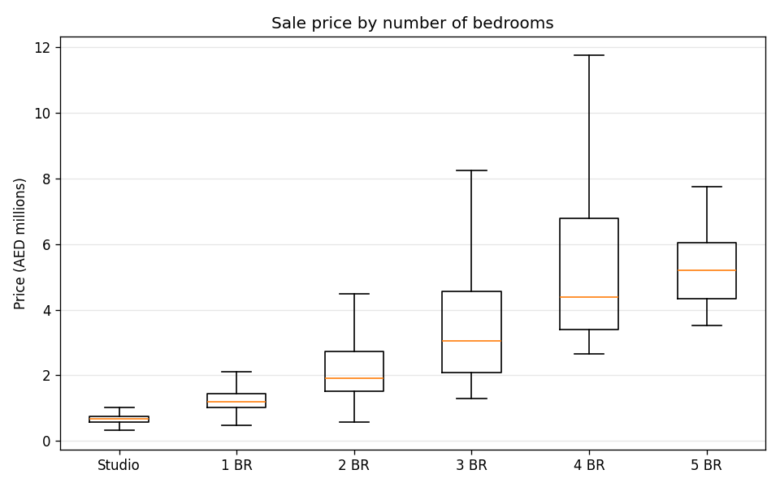
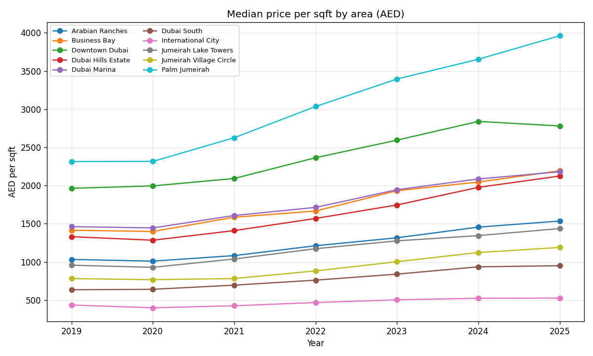
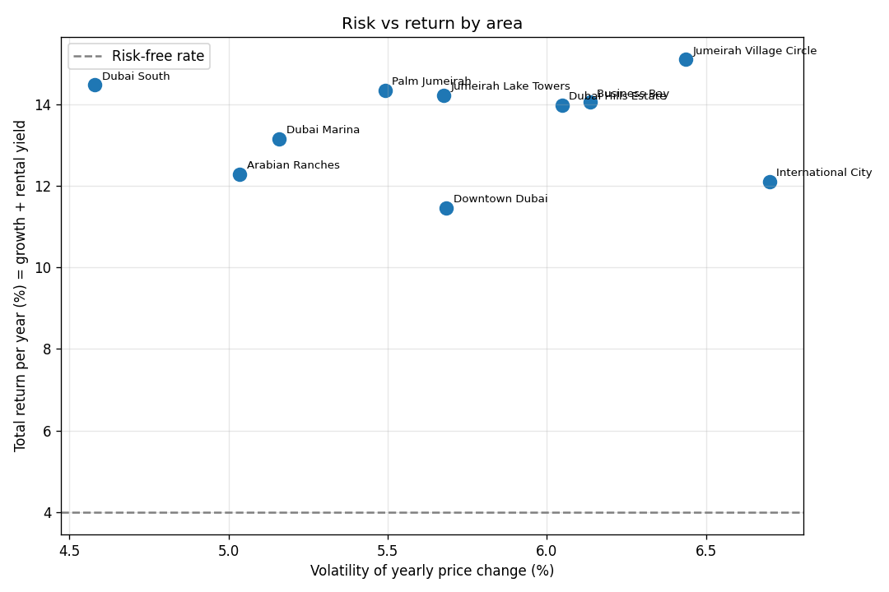
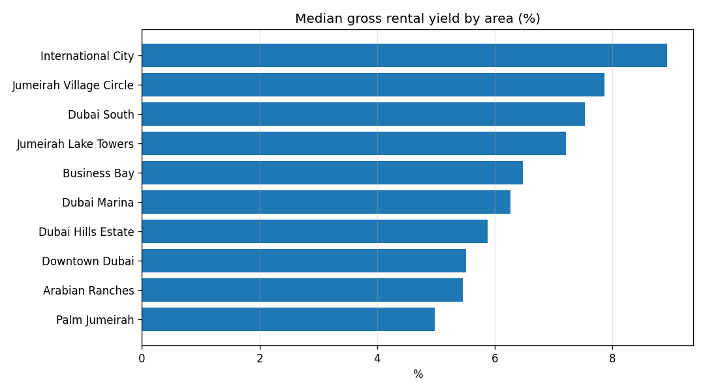
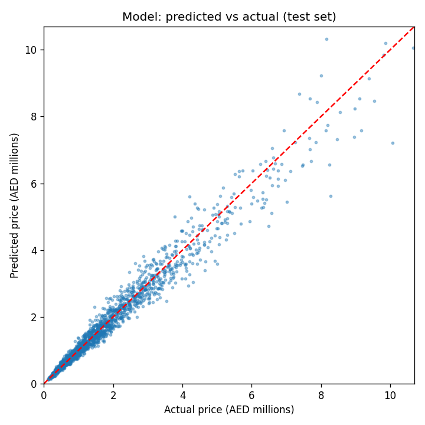

# Dubai Real Estate Investment Analysis

**Which Dubai neighbourhoods give investors the best return for the risk they take?**

This project looks at Dubai residential property the way an investment analyst would. It measures price growth, rental yield, volatility and risk-adjusted return (Sharpe ratio) for 10 major areas. It also trains a machine-learning model that estimates property prices and flags deals that look undervalued.

**Tools:** Python · pandas · scikit-learn · matplotlib · Streamlit · Plotly

The project has two parts:

| | Data | What it shows |
|---|---|---|
| **Part 1: Real market snapshot** | ✅ **Official Dubai Land Department (DLD) transactions** | Where prices are highest, off-plan vs ready, a price model tested on real sales |
| **Part 2: Multi-year investment framework** | ⚠️ Synthetic sample (simulated) | Price growth, rental yield, risk and Sharpe ratio per area. Runs on real data once multi-year DLD files are added |

---

## Part 1: Real market snapshot (official DLD data)

**Source:** [Dubai Land Department Open Data](https://dubailand.gov.ae/en/open-data/real-estate-data/). The raw file is in `data/raw/`. `src/prepare_dld_data.py` cleans it: it keeps only residential sales, converts sq m to sq ft and removes outliers. That leaves **774 residential sales worth AED 1.33 billion, registered 22–24 September 2026.**

| Area | Sales | Median price (AED) | Median AED / sqft | Off-plan share |
|---|---|---|---|---|
| Business Bay | 33 | 1,650,000 | 2,009 | 27% |
| City Of Arabia | 29 | 829,000 | 1,699 | 100% |
| Down Town Jabal Ali | 30 | 1,164,000 | 1,638 | 97% |
| Madinat Al Mataar | 42 | 1,078,000 | 1,586 | 100% |
| Dubai Marina | 21 | 1,700,000 | 1,584 | 10% |
| Jumeirah Village Circle | 65 | 1,129,000 | 1,431 | 58% |
| Dubai Land Residence Complex | 33 | 693,000 | 1,312 | 76% |
| Dubai Sports City | 16 | 700,000 | 1,021 | 12% |

*Selected areas with 15+ sales. The full table is in `data/real_area_summary.csv`.*

**What the real data shows**

1. **Off-plan dominates.** 69% of residential sales were off-plan, meaning homes bought from developers before they are built.
2. **Off-plan costs more per sq ft.** The median off-plan price is AED 1,670 per sq ft, about 20% above ready homes (AED 1,387). The total price is similar because off-plan units are smaller. Buyers pay a premium for new stock and developer payment plans.
3. **New growth corridors are pricing close to established areas.** Off-plan areas in the south, such as Madinat Al Mataar (near Al Maktoum Airport), Downtown Jebel Ali and City of Arabia, are selling at or above Dubai Marina's price per sq ft for ready homes.
4. **Jumeirah Village Circle is the most active market**, with 65 sales (8% of the total), led by affordable 1-bedroom apartments.
5. **The price model works on real data.** Tested with 5-fold cross-validation, it explains 68% of price variation (R² = 0.68) with a median error of 11.8%, using only area, size, bedrooms, type and off-plan status.







> **Limitation:** this is a 3-day snapshot. Rankings for areas with few sales can change from week to week. Adding more DLD files to `data/raw/` and rerunning the scripts updates every number and chart and adds a monthly trend chart automatically.

---

## Part 2: Multi-year investment framework (synthetic sample data)

> ⚠️ **About this data:** `data/sample_transactions.csv` is **synthetic** (simulated) data that looks like Dubai's market over 2019–2025. It shows how the risk-return framework works. The numbers are **not** official statistics.

### Key findings (sample data)

| Area | Price growth / yr | Gross rental yield | Volatility | Total return / yr | Sharpe ratio |
|---|---|---|---|---|---|
| Dubai South | 7.0% | 7.5% | 4.6% | 14.5% | 2.29 |
| Palm Jumeirah | 9.4% | 5.0% | 5.5% | 14.4% | 1.89 |
| Jumeirah Lake Towers | 7.0% | 7.2% | 5.7% | 14.2% | 1.80 |
| Dubai Marina | 6.9% | 6.3% | 5.2% | 13.2% | 1.78 |
| Jumeirah Village Circle | 7.3% | 7.9% | 6.4% | 15.1% | 1.73 |
| Dubai Hills Estate | 8.1% | 5.9% | 6.0% | 14.0% | 1.65 |
| Arabian Ranches | 6.8% | 5.5% | 5.0% | 12.3% | 1.65 |
| Business Bay | 7.6% | 6.5% | 6.1% | 14.1% | 1.64 |
| Downtown Dubai | 6.0% | 5.5% | 5.7% | 11.5% | 1.31 |
| International City | 3.2% | 8.9% | 6.7% | 12.1% | 1.21 |

**What this framework shows (on sample data)**

1. **Prime and affordable areas make money in different ways.** Palm Jumeirah returns come mostly from price growth. International City and JVC depend more on rental income.
2. **The highest return isn't always the best investment.** JVC had the highest total return, but once volatility is counted, Dubai South and Palm Jumeirah come out ahead on a risk-adjusted basis.
3. **The price model is accurate enough to screen deals.** It explains about 97% of price variation (R² = 0.97) with a typical error of about 10%. It found 93 recent deals priced more than 15% below the model's estimate.

#### Price trends


#### Risk vs return


#### Rental yields


#### Price model accuracy


---

## Methodology

| Metric | How it's calculated |
|---|---|
| Price per sqft | Transaction price ÷ size, median per area per year |
| Price CAGR | (latest median ÷ first median)^(1 ÷ years) − 1 |
| Gross rental yield | Annual rent ÷ purchase price (median) |
| Total return | Price CAGR + gross rental yield (simple approximation, before costs) |
| Volatility | Standard deviation of yearly % change in median price per sqft |
| Sharpe ratio | (Total return − 4% risk-free rate) ÷ volatility |

**Price model:** Gradient Boosting Regressor on log(price). Features: area, property type, size, bedrooms, year, off-plan flag. The data is split 80/20 into training and test sets, and accuracy is measured only on the unseen 20%.

**Limitations:** Gross yield ignores service charges, vacancy and fees. Total return is a simple sum, not a full IRR. Median prices can shift when the mix of properties sold changes from year to year.

---

## Project structure

```
dubai-real-estate/
├── app.py                        # Interactive Streamlit dashboard
├── data/
│   ├── raw/                      # Official DLD CSV downloads (add more files here)
│   ├── real_transactions.csv     # Cleaned real sales (made by prepare_dld_data.py)
│   ├── real_area_summary.csv     # Output: real prices per area
│   ├── sample_transactions.csv   # Synthetic sample data (8,400 transactions)
│   ├── area_metrics.csv          # Output: metrics per area
│   └── possible_undervalued_deals.csv  # Output: model's value finder
├── images/                       # Charts used in this README
├── src/
│   ├── prepare_dld_data.py       # Cleans official DLD downloads
│   ├── real_market_analysis.py   # Part 1: real market snapshot + model
│   ├── generate_sample_data.py   # Creates the synthetic dataset
│   ├── analysis.py               # Investment metrics + charts
│   └── model.py                  # ML price model + value finder
└── requirements.txt
```

## How to run

```bash
git clone https://github.com/ShaikhaKhaledAlz/dubai-real-estate.git
cd dubai-real-estate
pip install -r requirements.txt

# Part 1: real DLD data
python src/prepare_dld_data.py
python src/real_market_analysis.py

# Part 2: investment framework (sample data)
python src/analysis.py      # metrics table + charts
python src/model.py         # price model + undervalued deals
streamlit run app.py        # interactive dashboard in your browser
```

## Adding more real DLD data

1. Go to the [DLD Real Estate Data page](https://dubailand.gov.ae/en/open-data/real-estate-data/), choose a date range and **Transaction Type = Sales**, then click **Download as CSV**.
2. Save the file in `data/raw/`. You can add many files, for example one per month. Duplicates are removed automatically.
3. Run `python src/prepare_dld_data.py` and then `python src/real_market_analysis.py`.

## Next steps

- Load 2+ years of DLD sales and rental contracts so Part 2 (growth, yield, risk) runs fully on real data
- Net yield after service charges and fees; a full IRR model with mortgage leverage
- Compare with other Gulf markets (Abu Dhabi, Riyadh) and global cities
- Add macro factors (interest rates, oil price, population growth)

---

*Built by Shaikha as a portfolio project in data analysis and investment research.*
